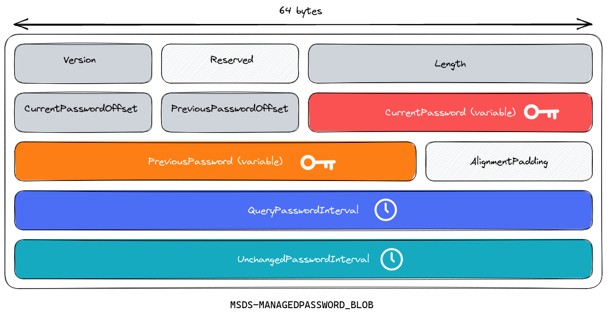
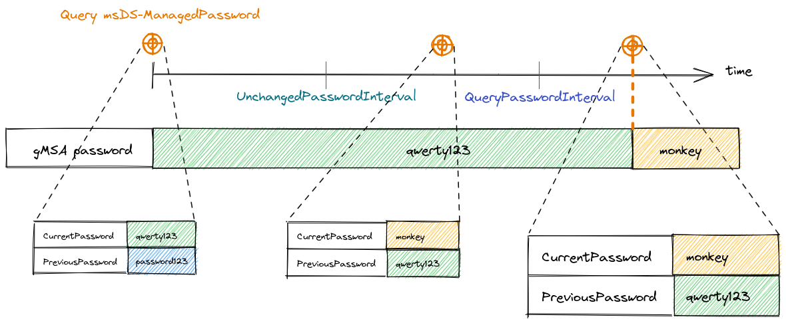

# What is a Group Managed Service Account?

A gMSA is an Active Directory account of type msDS-GroupManagedServiceAccount. This type of account is designed to be used on multiple Windows server to run a service.

The secret of a gMSA is managed by domain controllers and renewed periodically. For each gMSA, administrators can configure which (machine) accounts are allowed to retrieve its secret.

Microsoft has some documentation on the subject : https://docs.microsoft.com/en-us/windows-server/security/group-managed-service-accounts/group-managed-service-accounts-overview.

The secret is retrieved using LDAP by asking for the `msDS-ManagedPassword` attribute, which contains a `MSDS-MANAGEDPASSWORD_BLOB` structure that encapsulates the previous and current passwords. This structure is documented by Microsoft : https://learn.microsoft.com/en-us/openspecs/windows_protocols/ms-adts/a9019740-3d73-46ef-a9ae-3ea8eb86ac2e

<p align="center"></p>

- `CurrentPassword` and `PreviousPassword` contain password in null-terminated WCHAR string. 
- `QueryPasswordInterval` and `UnchangedPasswordInterval` are time offsets.

We did not find any documentation explaining exactly what are those time offsets and how does the gMSA secret rotate. What we understood by experimentation :
- After UnchangedPasswordInterval, we have access to the next gMSA password throught the `CurrentPassword` part of msDS-ManagedPassword.
- After QueryPasswordInterval, the domain controller will change the gMSA password (to the value stored in `CurrentPassword`) as soon as someone query the `msDS-ManagedPassword` attribute.

<p align="center"></p>

To retrieve the password, i.e. query `msDS-ManagedPassword`, the LDAP connection needs to provide confidentiality. It can be provided using:
* GSSAPI Privacy (`kerberos`)
* TLS (`tls`)


The list of account allowed to access the gMSA password is stored in the `msDS-groupMSAMembership`. This attribute contains a Windows security descriptor. Here is an example:

The `msDS-groupMSAMembership` content in base64:

```
AQAEgIgAAAAAAAAAAAAAABQAAAAEAHQAAwAAAAAAJAD/AQ8AAQUAAAAAAAUVAAAAUPkjsltukUyca7Kk6AMAAAAAJAD/AQ8AAQUAAAAAAAUVAAAAUPkjsltukUyca7KkVQQAAAAAJAD/AQ8AAQUAAAAAAAUVAAAAUPkjsltukUyca7KkVwQAAAECAAAAAAAFIAAAACACAAA=
```

The content parsed and formatted in JSON:

```json
{
  "revision": 1,
  "control_flags_raw": 32772,
  "control_flags": [
    "SE_DACL_PRESENT"
  ],
  "owner_sid": "S-1-5-32-544",
  "owner": "S-1-5-32-544",
  "group_sid": "S-1-25600",
  "group": "S-1-25600",
  "dacl": {
    "revision": 4,
    "count": 2,
    "entries": [
      {
        "ace_type": "ACCESS_ALLOWED",
        "ace_type_raw": 0,
        "ace_flags_raw": 0,
        "ace_flags": [],
        "access_rights_raw": 983551,
        "access_rights": [
          "ADS_RIGHT_DS_CREATE_CHILD",
          "ADS_RIGHT_DS_DELETE_CHILD",
          "ADS_RIGHT_ACTRL_DS_LIST",
          "ADS_RIGHT_DS_SELF",
          "ADS_RIGHT_DS_READ_PROP",
          "ADS_RIGHT_DS_WRITE_PROP",
          "ADS_RIGHT_DS_DELETE_TREE",
          "ADS_RIGHT_DS_LIST_OBJECT",
          "ADS_RIGHT_DS_CONTROL_ACCESS",
          "DELETE",
          "READ_CONTROL",
          "WRITE_DACL",
          "WRITE_OWNER"
        ],
        "sid": "S-1-5-21-2988702032-1284599387-2763156380-1109",
        "subject": "S-1-5-21-2988702032-1284599387-2763156380-1109"
      },
      {
        "ace_type": "ACCESS_ALLOWED",
        "ace_type_raw": 0,
        "ace_flags_raw": 0,
        "ace_flags": [],
        "access_rights_raw": 983551,
        "access_rights": [
          "ADS_RIGHT_DS_CREATE_CHILD",
          "ADS_RIGHT_DS_DELETE_CHILD",
          "ADS_RIGHT_ACTRL_DS_LIST",
          "ADS_RIGHT_DS_SELF",
          "ADS_RIGHT_DS_READ_PROP",
          "ADS_RIGHT_DS_WRITE_PROP",
          "ADS_RIGHT_DS_DELETE_TREE",
          "ADS_RIGHT_DS_LIST_OBJECT",
          "ADS_RIGHT_DS_CONTROL_ACCESS",
          "DELETE",
          "READ_CONTROL",
          "WRITE_DACL",
          "WRITE_OWNER"
        ],
        "sid": "S-1-5-21-2988702032-1284599387-2763156380-1111",
        "subject": "S-1-5-21-2988702032-1284599387-2763156380-1111"
      }
    ]
  }
}
```

Each ACE gives access to one account. In this example, S-1-5-21-2988702032-1284599387-2763156380-1109 and S-1-5-21-2988702032-1284599387-2763156380-1111 are the SID of the accounts couscous$ and boulettes$ because the gMSA was created with this command:

```powershell
New-ADServiceAccount -Name "semoule" -ServicePrincipalNames "HTTP/semoule.cantine.local" -DNSHostName "semoule.cantine.local" -PrincipalsAllowedToRetrieveManagedPassword couscous$,boulette$
```
